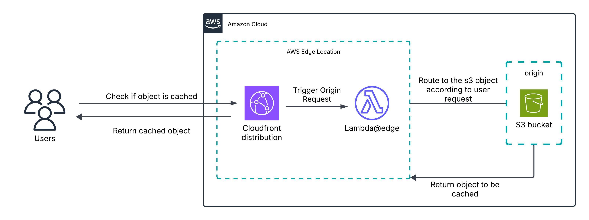

# 🌐 Multi-Static Website Hosting with AWS S3, Lambda, CloudFront, and SNS

This project demonstrates how to host **multiple static websites** on AWS using **S3 buckets**, deliver them globally with **CloudFront**, automate content updates and notifications using **AWS Lambda** and **SNS**.

---

## 📌 Overview

The system enables:
- Hosting of multiple static sites on separate S3 buckets
- Global content delivery through CloudFront distributions per site
- Automated content updates triggering Lambda functions
- Real-time notifications via SNS for content changes or events

This serverless architecture ensures scalable, secure, and cost-effective multi-site hosting.

---

## 🧭 Architecture Diagram

---

## 📖 Full Step-by-Step Guide

For detailed instructions, setup, and code, visit the full tutorial:

👉 [Full Setup Instructions](https://github.com/kkarki7120/Devops-project-event-announcement-system/)

---

## 🛠️ Services Used

- Amazon S3 (for static site hosting)  
- Amazon CloudFront (CDN)  
- AWS Lambda (automation and event processing)  
- Amazon SNS (notifications)  
- IAM Roles & Policies

---

## 📂 Folder Structure

